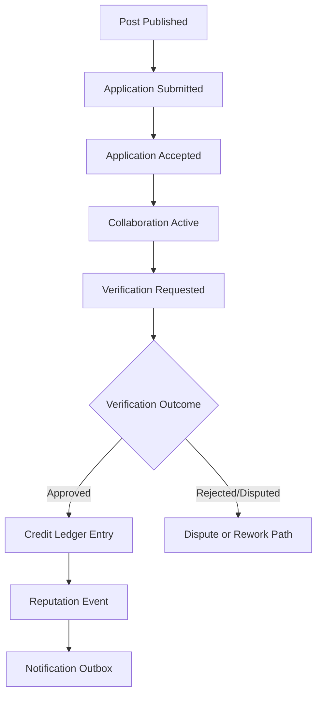
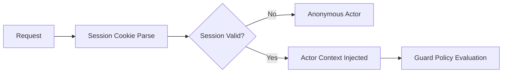

# Event Data Flow (Sprint 2 Planning)

## Purpose

Define lifecycle event streams required for trust-safe MVP behavior.

## Event Categories

- Contribution lifecycle events.
- Auth/session events.
- Verification/review events.
- Moderation/audit events.
- Notification dispatch events (outbox-backed).

## Contribution Flow Events

- `post.created`
- `application.submitted`
- `application.accepted` / `application.rejected`
- `collaboration.started`
- `collaboration.submitted_for_verification`
- `verification.approved` / `verification.rejected`
- `credits.settled`
- `reputation.recorded`

## Auth/Session Events

- `auth.sign_in_success`
- `auth.sign_in_failed`
- `session.issued`
- `session.revoked`
- `session.expired`
- `auth.sign_out`

## Moderation Events

- `moderation.case_opened`
- `moderation.action_applied`
- `moderation.case_resolved`
- `moderation.escalated`
- `audit.entry_written`

## Event Reliability Considerations

- Use idempotency keys for settlement and reputation events.
- Persist domain event + outbox record within same transaction where possible.
- Consumer side must support at-least-once delivery safety.

## Mermaid: Contribution + Trust Settlement Flow

## Mermaid: Auth/Request Actor Flow

## OPEN DECISION

- Outbox transport choice for MVP (DB poller vs queue broker).
- Event schema versioning strategy.
- Notification delivery guarantees (best-effort vs guaranteed retry windows).
